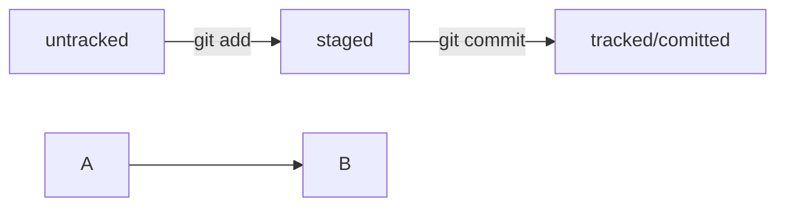

# git-hints
---

## Навигация
- **pwd** (от англ. print working directory, «показать рабочую папку») — покажи, в какой я папке;
- **ls** (от англ. list directory contents, «отобразить содержимое директории») — покажи файлы и папки в текущей папке;
- **ls -a** — покажи также скрытые файлы и папки, названия которых начинаются с символа .;
- **cd first-project** (от англ. change directory, «сменить директорию») — перейди в папку *first-project*;
- **cd first-project/html** — перейди в папку *html*, которая находится в папке *first-project*;
- **cd ..** — перейди на уровень выше, в родительскую папку;
- **cd ~** — перейди в домашнюю директорию *(/Users/Username)*;
- **cd /** — перейди в корневую директорию.

## Работа с файлами и папками
### Создание
- **touch index.html** (англ. touch, «коснуться») — создай файл *index.html* в текущей папке;
- **touch index.html style.css script.js** — если нужно создать сразу несколько файлов, можно напечатать их имена в одну строку через пробел;
- **mkdir second-project** (от англ. make directory, «создать директорию») — создай папку с именем *second-project* в текущей папке.

### Копирование и перемещение
- **cp file.txt ~/my-dir** (от англ. copy, «копировать») — скопируй файл в другое место;
- **mv file.txt ~/my-dir** (от англ. move, «переместить») — перемести файл или папку в другое место.

### Чтение
- **cat file.txt** (от англ. concatenate and print, «объединить и распечатать») — распечатай содержимое текстового файла *file.txt*.

### Удаление
- **rm about.html** (от англ. remove, «удалить») — удали файл *about.html*;
- **rmdir images** (от англ. remove directory, «удалить директорию») — удали папку *images*;
- **rm -r second-project** (от англ. remove, «удалить» + recursive, «рекурсивный») — удали папку *second-project* и всё, что она содержит.

### Полезные возможности
Команды необязательно печатать и выполнять по очереди. Можно указать их списком — разделить двумя амперсандами (*&&*).
У консоли есть собственная память — буфер с несколькими последними командами. По ним можно перемещаться с помощью клавиш со стрелками вверх (↑) и вниз (↓). Чтобы не вводить название файла или папки полностью, можно набрать первые символы имени и дважды нажать *Tab*. Если файл или папка есть в текущей директории, командная строка допишет путь сама. Например, вы находитесь в папке *dev*. Начните вводить *cd first* и дважды нажмите *Tab*. Если папка *first-project* есть внутри *dev*, командная строка автоматически подставит её имя. Останется только нажать *Enter*.

## Инициализация репозитория
- **git init** (от англ. initialize, «инициализировать») — инициализируй репозиторий.

## Подготовка файла к коммиту
- **git add todo.txt** (от англ. add, «добавить») — подготовь файл *todo.txt* к коммиту;
- **git add --all** (от англ. add, «добавить» + all, «всё») — подготовь к коммиту сразу все файлы, в которых были изменения, и все новые файлы;
- **git add .** — подготовь к коммиту текущую папку и все файлы в ней.

## Создание коммита
- **git commit -m "Комментарий к коммиту."** (от англ. commit, «совершать», «фиксировать» + message, «сообщение») — сделай коммит и оставь комментарий, чтобы было проще понять, какие изменения внесены. 
Просмотр информации о коммитах
- **git log** (от англ. log, «журнал [записей]») — выведи подробную историю коммитов.

## Просмотр состояния файлов
- **git status** (от англ. status, «статус», «состояние») — покажи текущее состояние репозитория.

## Синхронизация локального и удалённого репозиториев
- **git remote add origin https://github.com/YandexPracticum/first-project.git** (от англ. remote, «удалённый» + add, «добавить») — привяжи локальный репозиторий к удалённому с URL *https://github.com/YandexPracticum/first-project.git*;
- **git remote -v** (от англ. verbose, «подробный») — проверь, что репозитории действительно связались;
- **git push -u origin main** (от англ. push, «толкать») — в первый раз загрузи все коммиты из локального репозитория в удалённый с названием *origin*.

> Ваша ветка может называться *master*, а не *main*. Подправьте команду, если это необходимо.

- **git push** (от англ. push, «толкать») — загрузи коммиты в удалённый репозиторий после того, как он был привязан с помощью флага -u.

## Копирование чужих репозиториев
### Клонирование
- **git clone git@github.com:TheGreatOwner/the-great-project.git** (от англ. clone, «клон», «копия») — склонируй репозиторий с URL *the-great-project.git* из аккаунта *TheGreatOwner* на мой локальный компьютер.

### «Форк»
- **«Форк»** — операция, которая не связана с Git напрямую и выполняется через графический интерфейс GitHub (кнопка *Fork* в правом верхнем углу страницы репозитория). «Форк» создаёт независимую копию репозитория со всеми файлами, коммитами и ветками в аккаунте GitHub. Такая копия будет полностью независима. Внесённые изменения не будут синхронизированы с исходным репозиторием.
> Комбинацию «форк» + clone часто используют для внесения изменений в публичные репозитории. В этом случае «форк» становится подготовительным этапом перед клонированием чужого репозитория на локальный компьютер. Если репозиторий приватный или это репозиторий вашей компании, при работе с ним достаточно clone.

## SSH-ключи
Протокол SSH обеспечивает безопасный обмен данными в сети. С его помощью можно получать данные с удалённого компьютера или отправлять их на него. Трафик шифруется, поэтому протокол безопасен.
**SSH-ключ** состоит из двух частей — публичной и приватной. Приватный ключ хранится только на вашем компьютере и не должен передаваться кому-либо ещё. Он используется для расшифровки данных. Публичный ключ доступен всем и используется для шифрования данных. Они могут быть расшифрованы парным приватным ключом.
Файл с расширением *.pub* содержит публичный ключ, им можно делиться с веб-сайтами или коллегами. Файл без расширения *.pub* — приватный.
Прежде чем генерировать новую пару ключей, следует убедиться, что они отсутствуют на вашем компьютере. Проверить это можно командой **ls -la .ssh/** в домашней директории. Если ключи отсутствуют, создать их можно командой **ssh-keygen** в директории **~/.ssh**. После генерации ключ нужно привязать к GitHub.

## Хеш, лог и HEAD
- **Хэш коммита** - идентификатор коммита, полученный с помощью алгоритма SHA-1.
- Хэш обладает свойством: если хоть что-то в исходных данных поменяется, хеш тоже изменится.
- Git хранит таблицу соответствий хеш → информация о коммите в служебных файлах **.git**.
- **Лог** - список коммитов с описанием, содержит хеш, автора, дату и сообщение к коммиту.
- **Сокращённый лог** - список коммитов с описанием, содержит только первые несколько символов хеша и комментарии.
- Файл **HEAD** указывает на последний (самый новый) коммит.
- При работе с Git указатель HEAD используется часто, вместо хеша последнего коммита можно просто написать слово HEAD.

## Зачем нужны статусы файлов и как читать git status
- **Git** использует статусы файлов для отслеживания изменений в репозитории.
- Статусы файлов включают: **untracked**, **staged**, **modified**, and **tracked**.
- **Untracked** файлы - новые файлы, не отслеживаемые Git'ом.
- **Staged** файлы - файлы, добавленные в staging area командой git add.
- **Modified** файлы - файлы с изменениями, найденными Git'ом.
- **Tracked** файлы - файлы, закоммиченные или добавленные в staging area.
- **Жизненный цикл файла в Git**: создание, добавление в staging area, коммит, изменение, повторное добавление в staging area, коммит.
- Команда **git status** показывает статусы файлов: staged, modified, untracked.
git 

## Оформление сообщений к коммитам
Сообщения к коммитам важны для определения содержимого коммита и облегчения работы с ним.
- Сообщения должны быть короткими, информативными и легко читаемыми.
- Разные команды и проекты могут использовать разные стили оформления сообщений.
- Общие рекомендации включают длину сообщения от 30 до 72 символов, использование глаголов в инфинитиве и указание **Jira-ID** при корпоративном стиле.
- **Conventional Commits** предлагает стандартизированный формат коммита с указанием типа изменений.
- **GitHub-стиль** позволяет указывать ссылки на задачи в сообщениях коммитов.
- Рекомендации для использования инфинитивов и повелительного наклонения в сообщениях на разных языках также существуют.

## mermaid-схемы
- Для получения **mermaid-схемы** в **README.md** нужно добавить блок кода типа **mermaid**.
- Блоки кода в маркдауне начинаются и заканчиваются тремя символами **\```**. После первых трёх **\```** можно указать, какой именно код будет внутри блока. Например: **\```mermaid**, **\```bash**, **\```python**, **```javascript**" и так далее. Если ничего не указать, GitHub будет считать весь код простым текстом.
- **Перед блоком и после нужны пустые строки**, иначе GitHub не поймет, что это блок кода.
- Два символа **%%** обозначают в mermaid строку-комментарий.
- Чтобы сделать схему, нужно указать формат: **graph LR**.
- Чтобы добавить элементы и связи (стрелки), используют строки вида **A --> B**.
- Дополнительно можно указывать текст на стрелке. Например, так: **A -- "text" --> B.**



## Просмотр информации о коммитах
- **git log** (от англ. log, «журнал [записей]») — выведи подробную историю коммитов;
- **git log --oneline** (от англ. log, «журнал [записей]» + one line, «одной строкой») — покажи краткую информацию о коммитах: сокращённый хеш и сообщение.

## Просмотр состояния файлов
- **git status** (от англ. status, «статус», «состояние») — покажи текущее состояние репозитория.

## Добавление изменений в последний коммит
- **git commit --amend --no-edit** (от англ. amend, «исправить») — добавь изменения к последнему коммиту и оставь сообщение прежним;
- **git commit --amend -m "Новое сообщение"** — измени сообщение к последнему коммиту на Новое сообщение.

***💡 Выйти из редактора Vim: нажать Esc, ввести :qa!, нажать Enter.***

## «Откат» файлов и коммитов
- **git restore --staged hello.txt** (от англ. restore, «восстановить») — переведи файл **hello.txt** из состояния **staged** обратно в **untracked** или **modified**;
- **git restore hello.txt** — верни файл **hello.txt** к последней версии, которая была сохранена через **git commit** или **git add**;
- **git reset --hard b576d89** (от англ. reset, «сброс», «обнуление» + hard, «суровый») — удали все незакоммиченные изменения из staging и «рабочей зоны» вплоть до указанного коммита.

## Просмотр изменений
- **git diff** (от англ. difference, «отличие», «разница») — покажи изменения в «рабочей зоне», то есть в modified-файлах;
- **git diff a9928ab 11bada1** — выведи разницу между двумя коммитами;
- **git diff --staged** — покажи изменения, которые добавлены в staged-файлах.